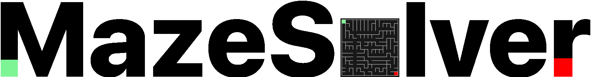
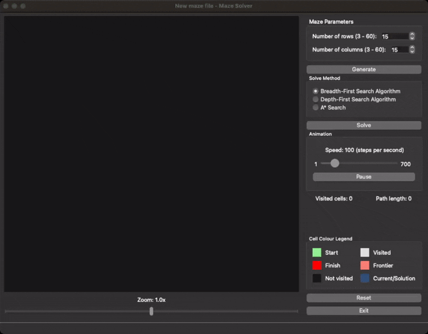

<p align="center">
  <br/>
  
  <br/><br/>
</p>

<p align="center">
  <strong>A Qt/C++ application for dynamically generating mazes and visualizing pathfinding algorithms.</strong>
</p>


<p align="center">
  <a href="https://github.com/patrykkuta/maze-solver/blob/main/LICENSE"></a>
  
  
    
  
</p>


# 🌟 Overview
**Maze Solver** is a Qt/C++ application designed to enhance understanding of pathfinding algorithms through dynamic visualisation. As a bonus, maze generation using Randomised Prim’s algorithm is also visualised.

The application animates each solution step-by-step, colouring cells based on their role in the search process. It displays cells already visited by the algorithm and cells currently stored in the frontier, to better explain the working of the selected algorithm. It also shows the total number of visited cells and the final path length, allowing users to compare the efficiency of different algorithms.

# 🚀 Demo

<p align="center">
  
</p>

# 🎯 Features

* 🧩 **Dynamic Maze Sizes:** From 3×3 to 60×60.
* 🏗️ **Generate Perfect Mazes:** Generate perfect mazes (no loops or inaccessible areas) using Randomised Prim’s algorithm.
* 🔍 **Algorithm Suite:** Switch between Breadth-First Search, Depth-First Search, and A* Search algorithms for path finding.
* ⚡ **Animation Control:** Tweak generation/solving animation from 1 step/sec to 700 steps/sec, or stop/resume it.
* 💾 **Save & Load:** Export mazes as <kbd>.maze</kbd> files and revisit them later.
* 🔎 **Zoom & Pan:** Inspect every twist and turn in large mazes.

# 🛠️ Built With

* **Language**: C++17
* **GUI Framework**: Qt 6
* **Build System**: CMake
* **Platforms**: macOS, Windows

# 🏁 Getting Started
## Prerequisites

* Qt 6.x
* CMake 3.5 or higher
* A C++17-compatible compiler

## Installation
Please see the following instructions for different operating systems:
## Windows
1. Clone the repository.
    ```bash
    git clone https://github.com/patrykkuta/Maze-Solver.git
    ```
2. Build the application.
    ```bash
    cd Maze-Solver
    mkdir build
    cd build
    cmake -DCMAKE_PREFIX_PATH="path/to/qt/msvc/compiler" .. # e.g. C:/Qt/6.8.3/msvc2022_64
    cmake --build .
    ```
3. Run the application.
    ```bash
    ./Debug/MazeSolver.exe
    ```

## macOS

1. Clone the repository.
    ```bash
    git clone https://github.com/patrykkuta/Maze-Solver.git
    ```
2. Build the application.
    ```bash
    cd Maze-Solver
    mkdir build && cd build
    cmake ..
    cmake --build .
    ```
3. Run the application.
    ```bash
    open MazeSolver.app
    # Or run the binary directly:
    ./MazeSolver.app/Contents/MacOS/MazeSolver
    ```

# 📖 Usage

1. Select maze dimensions (3×3–60×60). 
2. Click <kbd>Generate</kbd> to build the maze. 
3. Pick an algorithm: <kbd>BFS</kbd>, <kbd>DFS</kbd>, or <kbd>A*</kbd>. 
4. Click <kbd>Solve</kbd> to watch the solving process in real-time. 


**Tip**: Use the speed slider to control the animation speed and zoom slider for closer inspection.

## 🔄 Save & Load
* **Save**: After generating, press <kbd>File -> Save</kbd> to export a <kbd>.maze</kbd> file.
* **Load**: Press <kbd>File -> Open</kbd>, select your file, then solve with any algorithm.

# 🤝 Contributing

### Love it? Have ideas?
1.	Fork 👉 <kbd>gh repo fork patrykkuta/Maze-Solver --clone=true --remote=true</kbd>
2.	Create feature branch 👉 <kbd>git checkout -b feature/awesome-stuff</kbd>
3.	Commit changes 👉 <kbd>git commit -m "Add awesome feature"</kbd>
4.	Push & open PR 👉 <kbd>git push origin feature/awesome-stuff</kbd>

Please follow the existing style and include meaningful comments.

# 📜 License

This project is licensed under the **MIT License**. See LICENSE for details.

# ✉️ Contact

Found a bug or want to chat? Email: patryk9837@gmail.com
